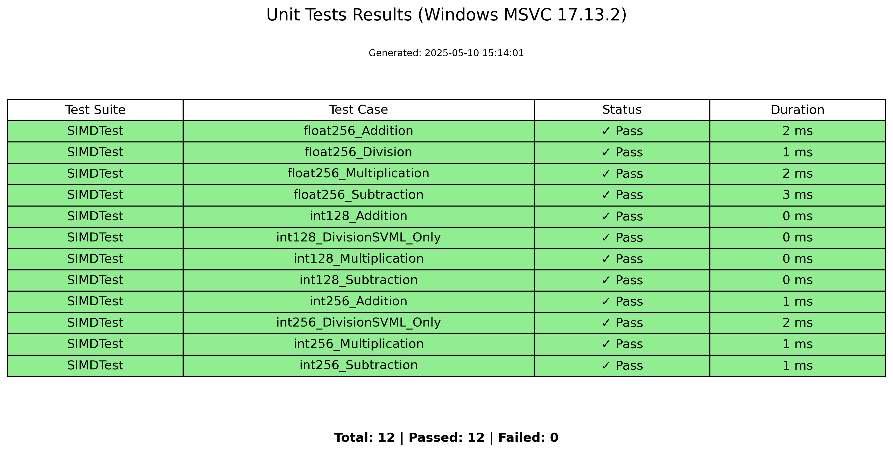
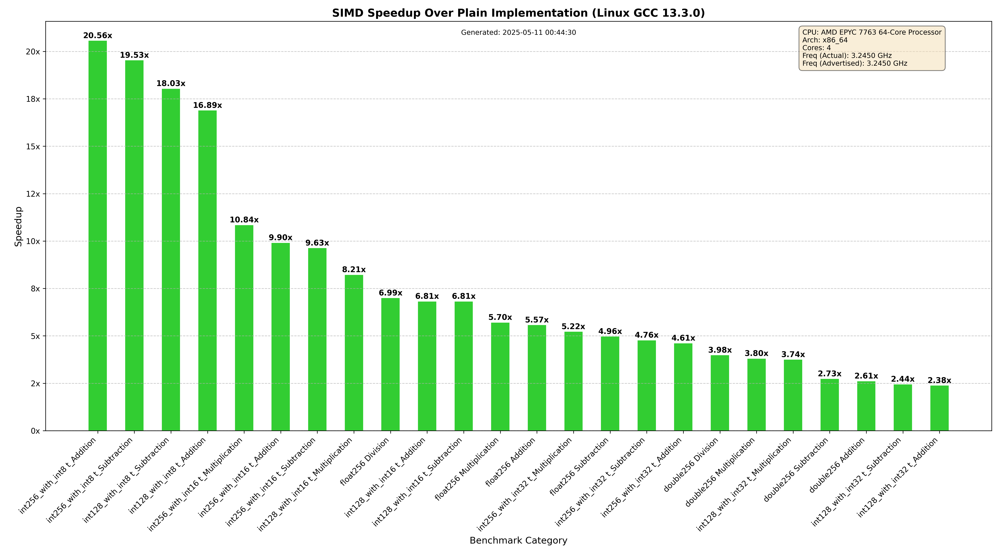
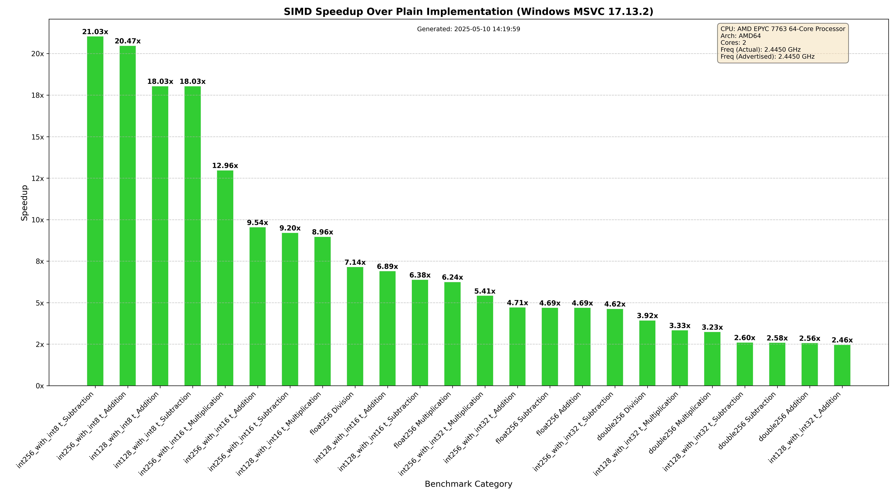

# SIMD Operations Framework

A high-performance C++ framework for SIMD (Single Instruction Multiple Data) operations, providing optimized vector math operations for both floating-point and integer data types. This library significantly accelerates data-parallel computations by leveraging CPU SIMD instruction sets.

## Features

- Optimized SIMD operations for different data types:
  - `Int128`, `Int256`, and `Int512` for integer operations (with `int8_t`, `int16_t`, and `int32_t`)
  - `Float256` and `Float512` for floating-point operations
  - `Double256` and `Double512` for double-precision operations
- Standard mathematical operations:
  - Addition
  - Subtraction
  - Multiplication
  - Division (for floating-point and double-precision)
  - Equality comparison
- Automatic vectorization with significant performance improvements
- Comprehensive test suite using Google Test
- Performance benchmarks using Google Benchmark

## Performance Results

### Unit Tests Status

  

### Performance Benchmarks

Performance improvements comparing SIMD operations vs. standard operations on different platforms with different compilers.

#### Linux (GCC) 
  


#### Windows (MSVC)



## Getting Started

### Prerequisites

- C++ compiler with SIMD support (tests verified on GCC and MSVC)
- CPU with support for relevant instruction sets (SSE2, AVX2, AVX512)

### User Guide

This is a header-only library, no building required:

```c++
#include <SIMD.h>
```

The available SIMD types will be detected by your IDE via IntelliSense. A basic runtime check is also implemented in SIMD types.

The library uses the namespace 'SIMD', but you can customize this before including the header:

```c++
#define BASIC_SIMD_NAMESPACE MySimdNamespace
#include <SIMD.h>
```

### Available Types

The following SIMD types are available on compatible CPU and compiler configurations:

| SIMD Type | Container Type | Width | Type of Each Element | Description | ISA Extension |
|:---------:|:--------------:|:-----:|:--------------------:|:-----------:|:-------------:|
| `SIMD::int_128<int8_t>` | Integer | 128 Bit | `int8_t` | Stores 16 elements, each `int8_t` | SSE2 |
| `SIMD::int_128<int16_t>` | Integer | 128 Bit | `int16_t` | Stores 8 elements, each `int16_t` | SSE2 |
| `SIMD::int_128<int32_t>` | Integer | 128 Bit | `int32_t` | Stores 4 elements, each `int32_t` | SSE2 |
| `SIMD::int_128<int64_t>` | Integer | 128 Bit | `int64_t` | Stores 2 elements, each `int64_t` | SSE2 |
| `SIMD::int_256<int8_t>` | Integer | 256 Bit | `int8_t` | Stores 32 elements, each `int8_t` | AVX2 |
| `SIMD::int_256<int16_t>` | Integer | 256 Bit | `int16_t` | Stores 16 elements, each `int16_t` | AVX2 |
| `SIMD::int_256<int32_t>` | Integer | 256 Bit | `int32_t` | Stores 8 elements, each `int32_t` | AVX2 |
| `SIMD::int_256<int64_t>` | Integer | 256 Bit | `int64_t` | Stores 4 elements, each `int64_t` | AVX2 |
| `SIMD::int_512<int8_t>` | Integer | 512 Bit | `int8_t` | Stores 64 elements, each `int8_t` | AVX512F or AVX512BW |
| `SIMD::int_512<int16_t>` | Integer | 512 Bit | `int16_t` | Stores 32 elements, each `int16_t` | AVX512F or AVX512BW |
| `SIMD::int_512<int32_t>` | Integer | 512 Bit | `int32_t` | Stores 16 elements, each `int32_t` | AVX512F |
| `SIMD::int_512<int64_t>` | Integer | 512 Bit | `int64_t` | Stores 8 elements, each `int64_t` | AVX512F |
| `SIMD::float_256` | Float | 256 Bit | `float` | Stores 8 elements, each `float` | AVX512F |
| `SIMD::float_512` | Float | 512 Bit | `float` | Stores 16 elements, each `float` | AVX512F |
| `SIMD::double_256` | Float | 256 Bit | `double` | Stores 4 elements, each `double` | AVX512F |
| `SIMD::double_512` | Float | 512 Bit | `double` | Stores 8 elements, each `double` | AVX512F |

## Usage Examples

Each SIMD type provides several operation modes to ensure optimal performance for different use cases:

### Basic Operations

```c++
// Initialize with values
SIMD::int_128<int8_t> a(1, 2, 3, 4, 5, 6); // Initialize with values
SIMD::int_128<int8_t> b; // Initialized to zero by default

// Standard operator syntax
SIMD::int_128<int8_t> result = a + b;

// Or using explicit methods
SIMD::int_128<int8_t> result2 = SIMD::int_128<int8_t>::Add(a, b);
```

### In-place Operations

```c++
SIMD::int_128<int8_t> a(1, 2, 3, 4, 5, 6);
SIMD::int_128<int8_t> b(10, 20, 30, 40, 50, 60);

// Using operator
a += b;

// Or explicit method
SIMD::int_128<int8_t>::AddInplace(a, b);
```

### Raw Memory Operations

For cases where you're working with existing aligned memory:

```c++
// Ensure proper alignment
alignas(SIMD::int_128<int8_t>::Alignment) int8_t a[16];
alignas(SIMD::int_128<int8_t>::Alignment) int8_t b[16];

// Fill arrays with data...

// Perform SIMD operation directly on memory
SIMD::int_128<int8_t>::AddInplaceRaw(a, b); // a += b
```

For large arrays, it's recommended to use an aligned dynamic memory allocator. The `AlignedMemory` namespace included with SIMD.h provides this functionality.

## Running Tests & Benchmarks

Use the provided scripts to run tests and benchmarks:

### Windows
```bash
run_tests.bat
```

### Linux
```bash
run_tests.sh
```

## License

This project is licensed under the GPLv3 License - see the LICENSE file for details.

## Contributing

Contributions to extend SIMD support are welcome! The project started based on personal needs but could benefit from community involvement.

### How to Contribute

1. Fork the repository
2. Create a feature branch
3. Implement your changes
4. Add or update tests as appropriate
5. Submit a pull request

The SIMD.h implementation uses macros to minimize repetitive code. The basic pattern is to define a macro for a new operator/function as a specialization of the base SIMD_Type_t, then apply it for different bit widths.

The SIMD::Array class provided in the codebase serves as a good example for building custom SIMD classes efficiently.

### Contact

For questions or suggestions, please contact: bertayeren@gmail.com
