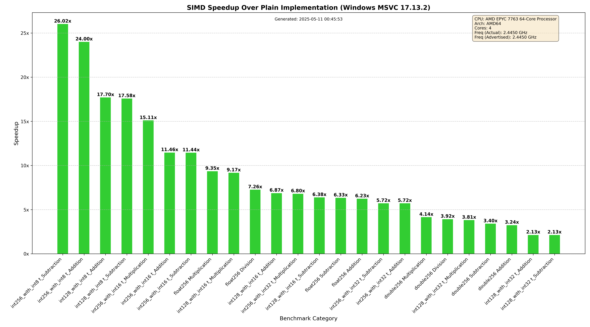

# SIMD Operations Framework

A high-performance C++ framework for SIMD (Single Instruction Multiple Data) operations, providing optimized vector math operations for both floating-point and integer data types.

## Features

- Optimized SIMD operations for different data types:
  - `Int128`, `Int256` and `Int512` for integer operations (with `int8_t`, `int16_t`, and `int32_t`)
  - `Float256` and `Float512` for floating-point operations
  - `Double256` and `Double512` for double-precision operations
- Standard mathematical operations:
  - Addition
  - Subtraction
  - Multiplication
  - Division (for floating-point and double-precision)
- Automatic vectorization with significant performance improvements
- Comprehensive test suite using Google Test
- Performance benchmarks using Google Benchmark

## Performance Results

### Unit Tests Status

✅ **All Tests Passed**: 10 out of 10 tests passed successfully

| Test | Status | Time |
|------|--------|------|
| int128_Addition | ✓ PASS | 0 ms |
| int128_Subtraction | ✓ PASS | 0 ms |
| int128_Multiplication | ✓ PASS | 0 ms |
| int256_Addition | ✓ PASS | 1 ms |
| int256_Subtraction | ✓ PASS | 1 ms |
| int256_Multiplication | ✓ PASS | 1 ms |
| float256_Addition | ✓ PASS | 1 ms |
| float256_Subtraction | ✓ PASS | 1 ms |
| float256_Multiplication | ✓ PASS | 1 ms |
| float256_Division | ✓ PASS | 1 ms |

### Performance Benchmarks

Performance improvements comparing SIMD operations vs. standard operations on different platforms with different compilers.

#### Linux (GCC) 
  


#### Windows (MSVC)



## Getting Started

### Prerequisites

- C++ compiler with SIMD support (AVX2 recommended)

### Using the Project

```bash
This is a header only project, no need for building. 
#include<SIMD.h>
Should be sufficient.
```

### Running Tests & Benchmarks

Use the provided batch script:

 #### Windows
```bash
run_tests.bat
```

#### Linux
```bash
run_tests.sh
```

## License

This project is licensed under the MIT License - see the LICENSE file for details.

## Contributing

Current state of the project is purely based on the personal needs, any contribution for extending SIMD support is appreciated & welcome.

The SIMD.h uses macros a lot to eliminate manual work of repetitive coding, but the idea is really simple; defining a macro for a new operator/function as a specialization of base SIMD_Type_t and then using it for different bit widths.